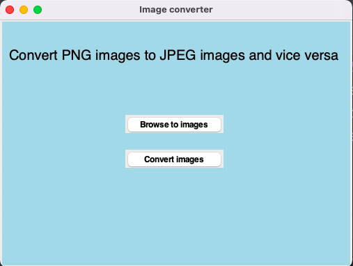
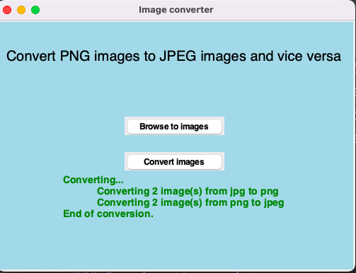

# GUI to convert images from PNG to JPEG and Vice versa
This python script permits the user to insert images from a directory 
and then converts these images from PNG to JPEG and vice versa.
At the end a description about the number of images converted from each extension to the
other is provided.

### Examples



### Running the script 
```commandline
python converter.py
```

### Libraries used
- PIL (pillow)
- sys
- os

### *Author Name*
[Mohamed El Hacen Habib](https://github.com/mohamedelhacen)